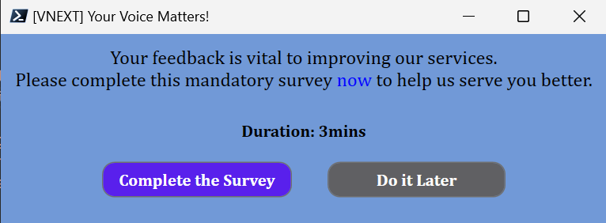

# PowerShell GUI to Complete the Survey

This is a remediation script solution that will show a GUI to a user in order to complete the survey.

Below is a screenshot of the GUI popup window.

 

 

When the user clicks on the `Complete the Survey` button, the survey URL (mentioned in the [Detection.ps1](Detection.ps1) script) will be launched in the default browser. In the background, a custom registry key called `IsSurveyFilled` at `HKEY_LOCAL_MACHINE\Software\CustomReg\FillSurvey` registry path will be set to true. Finally, the window will be closed.

When the user clicks on the `Do it Later` button, the `IsSurveyFilled` registry key will be set to false so that Intune will invoke the [Detection.ps1](Detection.ps1) script as per the schedule set in the remediation script package. This allows the value of the **IsSurveyFilled** registry key to be checked again, and if the value is false, the [Remediation.ps1](Remediation.ps1) script can be invoked again with the same popup window.
